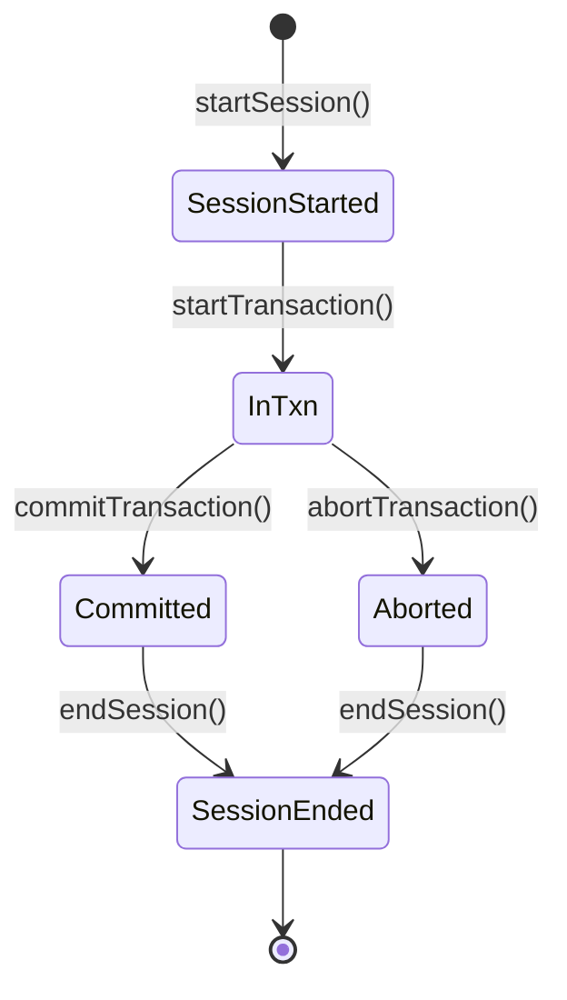
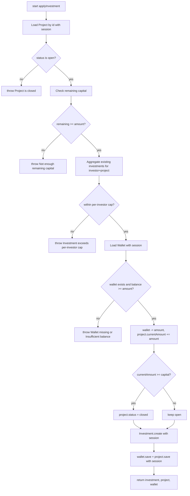
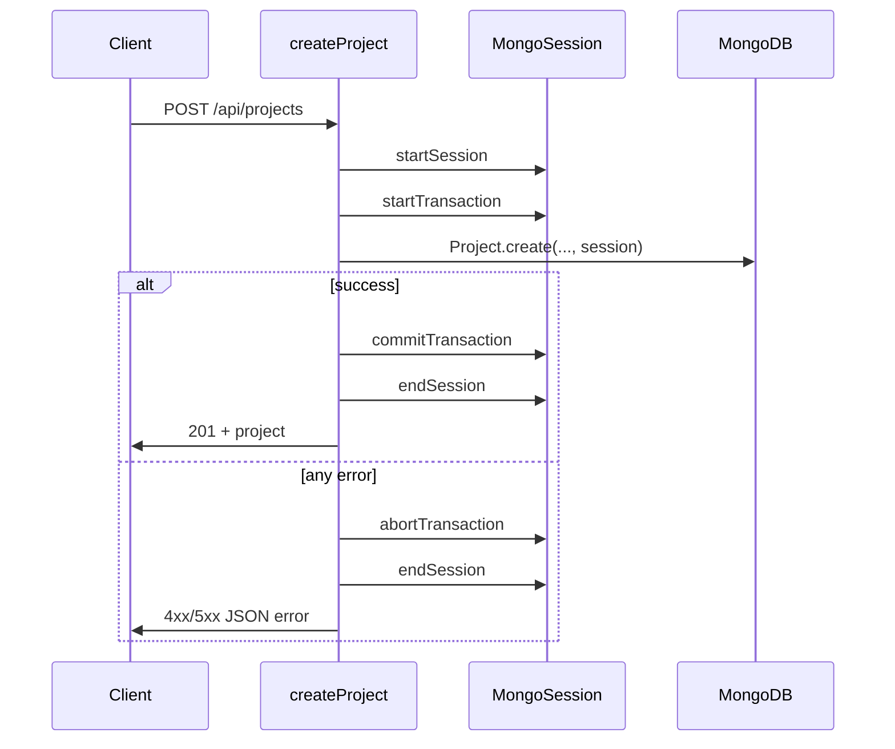
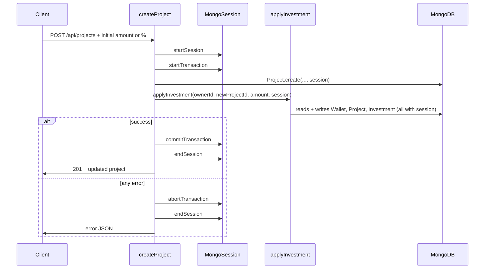
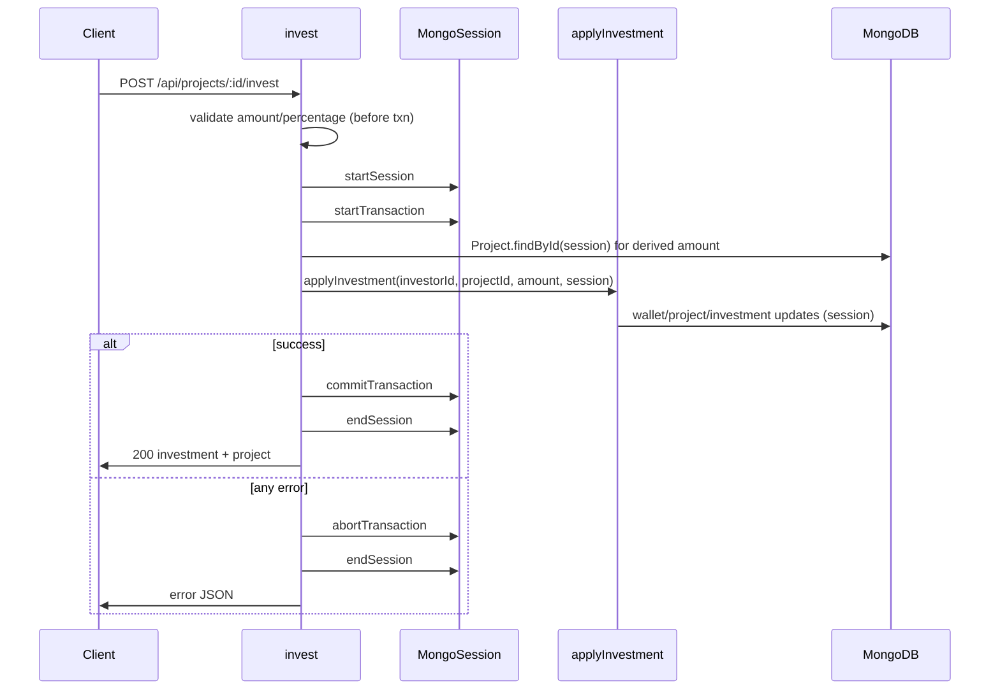

# Atomic operations: MongoDB sessions and transactions

This document explains **why** and **how** the Crowdfunder API uses **MongoDB client sessions** and **multi-document transactions** for `createProject` (with optional initial investment) and `invest`. It uses simple diagrams and a **failure matrix** so you can see **what the database looks like** if something goes wrong.

Related code:

- `[src/controller/Project.Controller.ts](../src/controller/Project.Controller.ts)` — `createProject`
- `[src/controller/Investment.Controller.ts](../src/controller/Investment.Controller.ts)` — `invest`
- `[src/service/investmentLogic.ts](../src/service/investmentLogic.ts)` — `applyInvestment`

---

## 1. Concepts in plain language
export const invest = asyncHandler(async (req: Request, res: Response, _next: NextFunction) => {
  const projectIdParamRaw = req.params.id;
  const projectIdParam = Array.isArray(projectIdParamRaw) ? projectIdParamRaw[0] : projectIdParamRaw;
  const investorId = req.user!.id;

  assertValidObjectId(projectIdParam, "project id");

  const { amount: amountFromBody, percentage }  = req.body as {
    amount?: number;
    percentage?: number;
  };

  const session = await mongoose.startSession();
  try {
    session.startTransaction();

    const project = await Project.findById(projectIdParam).session(session);
    if (!project) {
      throw new AppError("Project not found", 404);
    }

    let computedAmount: number | undefined = amountFromBody;

    if (percentage !== undefined) {
      const derived = Math.round((project.capital * percentage) / 100);
      if (derived <= 0) {
        throw new AppError("Percentage results in an invalid investment amount", 400);
      }

      if (computedAmount !== undefined) {
        if (Math.abs(computedAmount - derived) > 1) {
          throw new AppError("amount and percentage do not match project capital", 400);
        }
      } else {
        computedAmount = derived;
      }
    }

    if (computedAmount === undefined) {
      throw new AppError("Either amount or percentage is required", 400);
    }

    const result = await applyInvestment({
      investorId,
      projectId: projectIdParam,
      amount: computedAmount,
      session,
    });

    await session.commitTransaction();

    res.status(200).json({
      status: "success",
      data: {
        investment: result.investment,
        project: result.project,
      },
    });
  } catch (err) {
    await session.abortTransaction();
    throw err;
  } finally {
    session.endSession();
  }
});
### Client session (`mongoose.startSession()`)

A **session** is a handle MongoDB uses to group operations. By itself it does **not** guarantee “all or nothing.”

### Transaction (`session.startTransaction()` … `commit` / `abort`)

A **transaction** says: either **every write inside this transaction is applied together**, or **none of them are** (from the point of view of other readers once the transaction ends).

**After `abortTransaction()`:** changes made **only inside that transaction** are **rolled back**. Other clients never see partial writes from that transaction.

**After `commitTransaction()`:** all writes in the transaction become visible according to MongoDB rules.

### Why we need this here

`invest` and “project + initial investment” touch **more than one document** (and sometimes more than one collection):

- `Wallet` (balance)
- `Project` (`currentAmount`, maybe `status`)
- `Investment` (new row)

If we updated wallet and project but crashed before creating `Investment`, money would be inconsistent. **Transactions prevent that class of bug.**

---

## 2. Transaction lifecycle (state view)

**Rule used in this codebase:** if **any** error is thrown between `startTransaction()` and `commitTransaction()`, the `catch` block calls **`abortTransaction()`**, then rethrows the error so Express returns the right HTTP status.

---

## 3. What `applyInvestment` does (single “unit” of work)

`applyInvestment` is **not** responsible for starting or committing the transaction. The **caller** owns the transaction. `applyInvestment` only runs **inside** the passed `session`.

High-level steps **in order**:

**Important:** until `commitTransaction()` runs successfully in the **outer** controller, **none** of these writes are finalized for other transactions.

---

## 4. `createProject` — two shapes of the same operation

### 4a. Without initial investment

Only **one** logical write set: insert `Project` with `currentAmount = 0`, `status = open`.

**If it fails after `startTransaction` but before `commit`:**  
→ **No project row** is left behind (rolled back).

### 4b. With initial investment (same transaction)

**If `Project.create` succeeds but `applyInvestment` throws (e.g. insufficient wallet):**  
→ **`abortTransaction` rolls back everything**, including the **new project document**.  
From the client’s perspective: **no new project appears** in the database.

That is intentional: it avoids “orphan projects” with inconsistent funding state.

---

## 5. `invest` — standalone transaction

**Note:** `invest` loads the project **once** to compute amount from `percentage`, then `applyInvestment` loads the project **again** inside the same transaction. That is safe; the second read sees the same transactional snapshot.

---

## 6. Failure matrix — “what ends up in MongoDB?”

Legend:

- **Rolled back**: nothing from that request’s transaction remains visible to a normal read after the request finishes.
- **No txn**: failure happened before `startTransaction` (no multi-document atomic scope for that request).

| Operation | When it fails | HTTP (typical) | DB state after request |
|-----------|----------------|----------------|-------------------------|
| `createProject` | Zod / auth **before** transaction | 400 / 401 / 403 | No change |
| `createProject` | `Project.create` throws inside txn | 5xx / driver error | **Rolled back** — no project |
| `createProject` | `applyInvestment` throws (wallet, cap, closed, etc.) | 400 / 404 | **Rolled back** — **no project** (project insert undone) |
| `createProject` | Commit fails (rare: network, failover) | 5xx | MongoDB discards txn — **no partial** from that txn |
| `invest` | Bad id / validation **before** txn | 400 | No change |
| `invest` | `Project.findById` null inside txn | 404 | **Rolled back** — no writes |
| `invest` | `applyInvestment` throws | 400 / 404 | **Rolled back** — wallet/project/investment unchanged |
| `invest` | Commit fails (rare) | 5xx | **Rolled back** |

**Same operation fails twice:**  
Each attempt is a **new transaction**. A failed attempt leaves **no** durable effect from that attempt (for errors that trigger `abortTransaction`). The client can fix the cause (e.g. top up wallet) and retry.

---

## 7. What transactions do **not** guarantee

- **Business-level idempotency:** if the client retries after a **timeout**, it might double-invest unless you add idempotency keys (not implemented here).
- **Cross-request serialization:** two parallel `invest` requests can still race; transactions help each request stay internally consistent, but you may still want extra constraints (e.g. unique compound indexes) for specific invariants.
- **Read-your-own-writes outside the session:** other code without the same `session` may not see uncommitted data (correct MongoDB behavior).

---

## 8. Quick mental model

Think of a transaction as a **draft**:

1. Open draft (`startTransaction`)
2. Edit wallet + project + investment **on the draft**
3. Either **publish** (`commitTransaction`) or **discard** (`abortTransaction`)

`createProject` with initial investment is **one draft** that includes **both** “create project” and “first investment.” If the investment draft is invalid, the whole draft is discarded — including the project line.

---

*If you add new multi-document flows (refunds, admin adjustments), reuse the same pattern: one session per HTTP request, `apply*` helpers that accept `session`, and a single commit at the end.*
